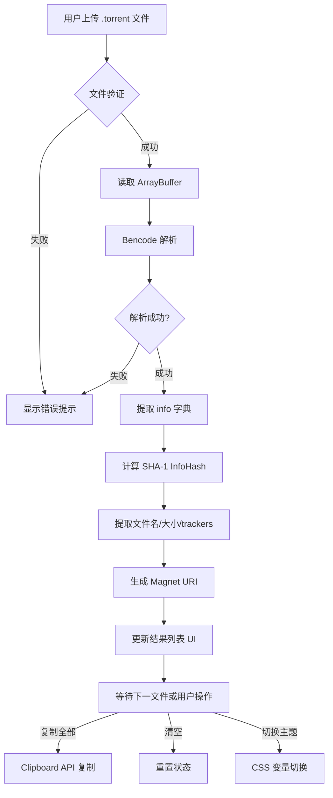

# Torrent to Magnet 批量转换工具 - 架构设计文档

## 1. 项目概述

本项目是一个纯前端的工具型 Web 应用，用于将多个 `.torrent` 文件批量转换为 magnet URI。应用采用单文件部署模式，无需后端服务器，所有解析逻辑均在浏览器端完成。

### 1.1 技术栈

- **HTML5**: 语义化结构
- **CSS3**: 样式与响应式布局（含暗色模式）
- **ES6+ JavaScript**: 核心业务逻辑
- **File API**: 文件上传与读取
- **Web Crypto API**: Infohash 计算（SHA-1）

### 1.2 浏览器兼容性

- Chrome 80+
- Firefox 75+
- Safari 13+
- Edge 80+

---

## 2. 目录结构

```
torrent2magnet/
├── index.html              # 主页面（单页应用入口）
├── SPEC.md                 # 项目规格说明
├── README.md               # 使用说明
├── src/
│   ├── styles/
│   │   └── main.css        # 主样式文件（含暗色模式变量）
│   ├── scripts/
│   │   ├── app.js          # 应用入口与初始化
│   │   ├── bencode.js      # Bencode 解析器
│   │   ├── magnet.js       # Magnet URI 生成器
│   │   ├── fileHandler.js  # 文件上传与处理
│   │   └── uiController.js # UI 状态管理
│   └── assets/
│       └── icons/          # SVG 图标资源（可选）
└── plans/
    └── architecture.md     # 本文档
```

### 2.1 简化版结构（推荐单文件部署）

```
torrent2magnet/
├── index.html              # 包含所有 HTML、CSS、JS 的单文件
├── SPEC.md                 # 项目规格说明
├── README.md               # 使用说明
└── plans/
    └── architecture.md     # 本文档
```

---

## 3. 核心文件功能说明

### 3.1 `index.html`（主入口）

| 功能 | 描述 |
|------|------|
| 文件上传区域 | 支持拖拽和点击上传 `.torrent` 文件 |
| 结果展示区 | 批量展示转换结果列表 |
| 控制面板 | 一键复制、清除、主题切换 |

**核心 DOM 结构**:
```html
<!-- 上传区域 -->
<div id="drop-zone" class="drop-zone">
    <input type="file" id="file-input" multiple accept=".torrent">
    <p>拖拽 .torrent 文件至此 或 点击选择</p>
</div>

<!-- 结果列表 -->
<div id="result-list" class="result-list"></div>

<!-- 控制栏 -->
<div id="controls" class="controls">
    <button id="copy-all-btn">复制全部</button>
    <button id="clear-btn">清空</button>
    <button id="theme-toggle">🌙</button>
</div>
```

### 3.2 Bencode 解析器 (`bencode.js`)

负责解析 `.torrent` 文件的 bencode 编码格式。

**核心函数**:

| 函数 | 功能 |
|------|------|
| `decodeTorrent(arrayBuffer)` | 解析 torrent 文件，返回解码后的对象 |
| `extractInfoHash(data)` | 从 info 字典计算 SHA-1 infohash |
| `extractInfo(data)` | 提取 info 字典（用于计算 infohash） |

**Bencode 数据类型规则**:
- **字符串**: `3:abc` → `"abc"`（长度:内容）
- **整数**: `i123e` → `123`
- **列表**: `l3:abc3:defe` → `["abc", "def"]`
- **字典**: `d3:key5:valuee` → `{"key": "value"}`

### 3.3 Magnet URI 生成器 (`magnet.js`)

负责根据解析的 torrent 数据生成标准 magnet URI。

**Magnet URI 参数说明**:

| 参数 | 说明 | 来源 |
|------|------|------|
| `xt` | 唯一标识（URN:btih:infohash） | info 字典 SHA-1 |
| `dn` | 显示名称（URL 编码） | info.name |
| `xl` | 文件总大小（字节） | info.length 或 files 总和 |
| `tr` |  trackers | announce / announce-list |
| `kt` | 关键词标签 | 可选 |

**生成格式**:
```
magnet:?xt=urn:btih:{infohash}&dn={name}&xl={size}&tr={tracker1}&tr={tracker2}
```

### 3.4 文件处理器 (`fileHandler.js`)

处理文件上传与批量管理。

**核心流程**:
1. 监听拖拽/选择事件
2. 验证文件类型（`.torrent`）
3. 读取文件为 ArrayBuffer
4. 调用 bencode 解析器
5. 调用 magnet 生成器
6. 更新 UI

### 3.5 UI 控制器 (`uiController.js`)

管理应用状态与 DOM 更新。

**状态管理**:
- `results[]`: 转换结果列表
- `theme`: 当前主题（light/dark）

---

## 4. Bencode 解析技术方案

### 4.1 解析算法

Bencode 解析器采用**递归下降解析**算法，时间复杂度 O(n)。

```javascript
function decode(data, index = 0) {
    const char = data[index];
    
    if (char === 'i') {
        // 整数: i123e
        return decodeInteger(data, index);
    } else if (char === 'l') {
        // 列表: l...e
        return decodeList(data, index);
    } else if (char === 'd') {
        // 字典: d...e
        return decodeDictionary(data, index);
    } else if (char >= '0' && char <= '9') {
        // 字符串: 长度:内容
        return decodeString(data, index);
    }
}
```

### 4.2 关键实现细节

| 步骤 | 实现 |
|------|------|
| 文件读取 | `FileReader.readAsArrayBuffer()` |
| 字节处理 | `Uint8Array` 按字节解析 |
| Infohash 计算 | `crypto.subtle.digest('SHA-1', infoBytes)` |
| 字符串解码 | UTF-8 编码转换 |

### 4.3 Torrent 文件结构（需解析字段）

```javascript
{
    announce: "http://tracker.example.com:80/announce",  // 主 tracker
    "announce-list": [[...], [...]],                     // tracker 列表
    created by: "uTorrent/3.4.9",
    creation date: 1609459200,
    info: {
        name: "example.torrent",           // 文件/目录名
        "piece length": 262144,             // 每片大小
        pieces: <binary>,                   // piece hash 列表
        length: 1048576,                    // 单文件大小
        // OR
        files: [                            // 多文件
            { length: 1024, path: ["dir", "file1.txt"] },
            { length: 2048, path: ["dir", "file2.txt"] }
        ]
    }
}
```

---

## 5. Magnet URI 生成规则

### 5.1 格式规范

根据 BitTorrent Magnet URI 规范：

```
magnet:?xt=urn:btih:{infohash}&dn={display_name}&xl={total_size}[&tr={tracker_url}]*
```

### 5.2 InfoHash 计算

1. 对 `info` 字典进行 bencode 编码
2. 计算 SHA-1 哈希
3. 将 20 字节 hex 字符串转为大写

```javascript
async function calculateInfoHash(torrentData) {
    const infoBytes = bencodeEncode(torrentData.info);
    const hashBuffer = await crypto.subtle.digest('SHA-1', infoBytes);
    const hashArray = Array.from(new Uint8Array(hashBuffer));
    return hashArray.map(b => b.toString(16).padStart(2, '0')).join('').toUpperCase();
}
```

### 5.3 Tracker 处理

- 优先使用 `announce-list`（多级数组扁平化）
- 回退到 `announce`
- 必须 URL 编码

### 5.4 显示名称

- 直接使用 `info.name`
- 需要 URL 编码（ encodeURIComponent）

---

## 6. 关键技术点

### 6.1 文件处理

| 要点 | 方案 |
|------|------|
| 大文件支持 | 流式读取（FileReader 分块） |
| 多文件并发 | Promise.all + 批量处理 |
| 内存管理 | 结果按需渲染，禁止数组索引跳跃 |

### 6.2 性能优化

- Web Workers（可选）：后台线程处理 bencode 解析
- 虚拟列表：大量文件时仅渲染可视区域
- 防抖：拖拽事件配合 requestAnimationFrame

### 6.3 错误处理

```javascript
try {
    const result = decodeTorrent(buffer);
    if (!result.info || !result.info.name) {
        throw new Error('Invalid torrent: missing info.name');
    }
    // ...
} catch (e) {
    console.error('Parse error:', e.message);
    // 显示用户友好的错误提示
}
```

### 6.4 暗色模式实现

使用 CSS 变量切换主题：

```css
:root {
    --bg-primary: #ffffff;
    --bg-secondary: #f5f5f5;
    --text-primary: #333333;
    --border-color: #e0e0e0;
}

[data-theme="dark"] {
    --bg-primary: #1a1a1a;
    --bg-secondary: #2d2d2d;
    --text-primary: #e0e0e0;
    --border-color: #404040;
}
```

---

## 7. 工作流程图



---

## 8. 测试用例设计

| 场景 | 输入 | 预期输出 |
|------|------|----------|
| 单文件解析 | 有效 .torrent 文件 | 正确的 magnet URI |
| 多文件批量 | 5 个 .torrent 文件 | 5 个结果的列表 |
| 无效文件 | 非 .torrent 文件 | 错误提示 |
| 空文件 | 0 字节文件 | 错误提示 |
| 损坏文件 | 非 bencode 数据 | 错误提示 |
| 多 tracker | 含 announce-list | 所有 tracker 在 URI 中 |
| 大文件 | >100MB .torrent | 正常解析（不阻塞 UI） |
| 主题切换 | 点击切换按钮 | 颜色变量切换 |
| 复制功能 | 点击复制按钮 | magnet URI 复制到剪贴板 |

---

## 9. 后续扩展建议

1. **PWA 支持**: 添加 Service Worker 实现离线可用
2. **历史记录**: LocalStorage 保存转换历史
3. **批量导出**: 生成包含所有 magnet 的文本/JSON 文件
4. **自定义 trackers**: 用户添加自定义 tracker 列表
5. **快捷键支持**: Ctrl+V 粘贴文件、Ctrl+A 全选等

---

*文档版本: 1.0*  
*创建时间: 2026-04-27*
